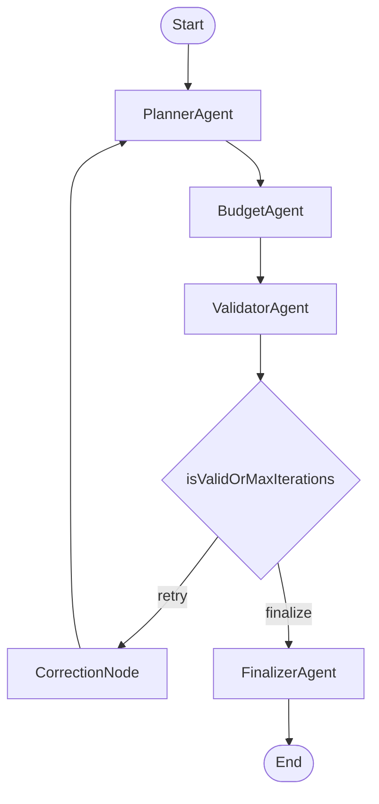

# Travel Planning Agent (LangGraph + Groq)

A simple AI Travel Planning Agent that shows:

- **Multi-Agent Orchestration** using LangGraph
- **Stateful Error-Correction** with deterministic validation loops
- **Free-hosted LLM access** using Groq API

The app uses Streamlit so you can run and understand it easily.

## What This Project Demonstrates

### 1) Multi-Agent Orchestration
The system has four focused agents:

- **Planner Agent**: Creates itinerary
- **Budget Agent**: Estimates trip costs
- **Validator Agent**: Checks constraints and budget with deterministic rules
- **Finalizer Agent**: Produces final polished markdown plan

These agents run as a LangGraph workflow and share one central state object.

### 2) Stateful Error-Correction
If validation fails, issues are saved in `correction_history` and fed back to the planner.
The graph loops until:

- plan is valid, or
- max correction iterations are reached

This makes behavior more stable and reduces random LLM mistakes.
Live URL
https://priyak0507-ai-travel-agent-app-cgh4bl.streamlit.app/

## Architecture



## Project Files

- `app.py` - Streamlit UI + live execution trace
- `workflow.py` - LangGraph orchestration
- `agents.py` - Planner/Budgeter/Validator/Finalizer logic
- `state.py` - Shared state and Pydantic schemas
- `requirements.txt` - dependencies

## Setup (Very Simple)

1. Create a virtual environment:

```bash
python -m venv .venv
source .venv/bin/activate
```

2. Install dependencies:

```bash
pip install -r requirements.txt
```

3. Run the app:

```bash
streamlit run app.py
```

4. In the sidebar:
- Enter destination, days, budget, interests, constraints
- Paste your **Groq API key**
- Click **Generate Travel Plan**

## Free LLM API Options

This implementation defaults to **Groq** (free key available on [Groq Console](https://console.groq.com)).

If you want, you can later add other free-hosted providers with small changes:
- Google Gemini (Google AI Studio free tier)
- OpenRouter free models
- Together AI free credits (if available)

## Notes

- The validator uses deterministic checks in Python, not only LLM judgment.
- If one model fails or is rate-limited, switch model in the sidebar and retry.
- This is intentionally simple, so it is easy to explain in interviews and easy to extend.
